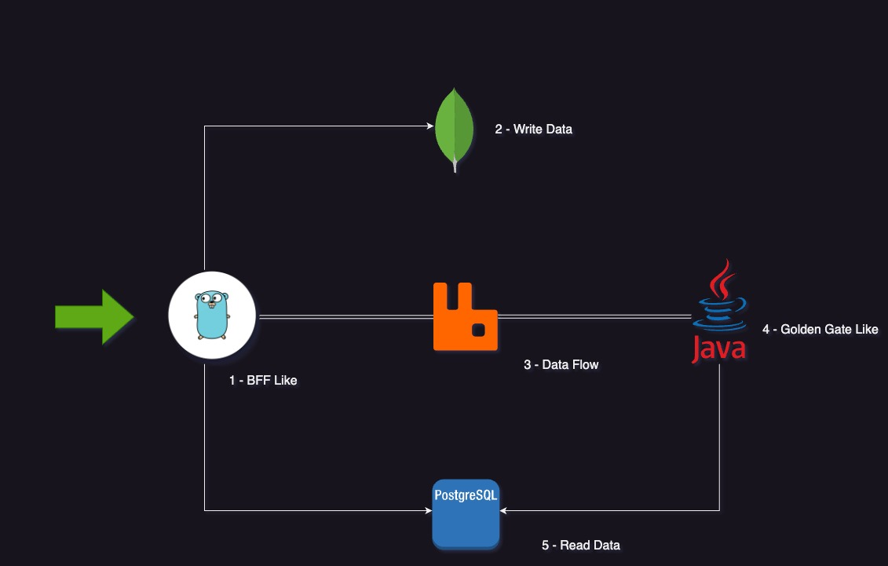

# psm-flow-testing

Este projeto visa construir um implementação simples aplicando algumas técnicas de arquitetura para resolver um problema: Salvar uma conta e transações dessa conta.

Simples assim não é?! Rsrs

Vamos a explicação:

Explicando o Fluxo:

1. **BFF Like** - Este projeto está desenvolvido com Golang onde ele é responsável por salvar contas e transações num MongoDB (Item 2) e também duplicar os dados para um Broker Rabbit (Item 3)
2. Banco de dados não-relacional (MongoDB) para poder armazenar os dados de forma sequencial, usado para banco de escrita. * -> Aqui temos um ponto importante: Poderíamos simplificar retirando o Broker e configurar o MongoDB para ***Change Stream*** e assim usar o Golden Gate direto. A ideia do Broker é uma separação maior de controle para observabilidade futura dos dados.
3. Broker de controle de dados.
4. **Golden Gate Like** - Esse projeto está desenvolvido em Java com SpringBoot. Ele é responsável por ser consumidor desse broker e alimentar um Postgres (Item 5) para servir de banco para leitura.
5. Banco de dados relacional (Postgres) para armazenar os dados para serem lidos de forma rápida e dinâmica.

# Está 100%? Ainda não

* Não implementado ainda testes unitários e integrados;
* SOLID ainda não está 100%, falta refatoração (Matéria de estudos).

# Como rodar?

- Os projetos psm-validate e psm-pkg possuem seus dockerfile para
  geração dos containeres.
- Existe um Docker-compose que integra tudo;
  ``docker build -t psm-validate .``
  ``docker build -t psm-pkg .``
  ``./docker-compose up``
